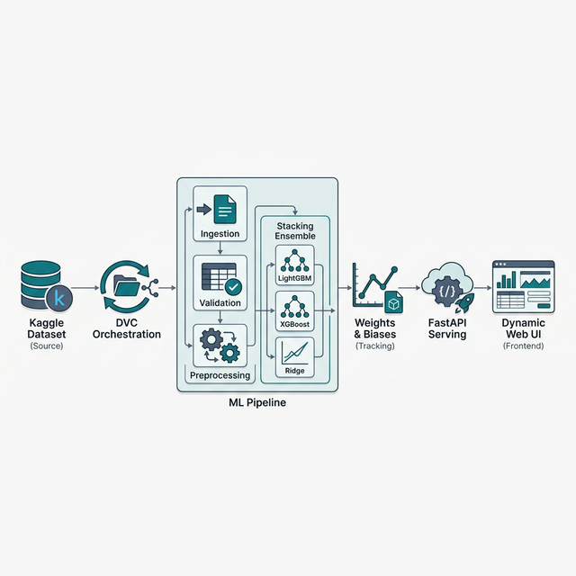

# Global AI Salary Predictor: End-to-End MLOps Pipeline

[](https://www.python.org/)
[](https://dvc.org/)
[](https://wandb.ai/)
[](https://fastapi.tiangolo.com/)

A repository implementing a complete machine learning lifecycle for salary prediction. This project achieves a **0.93 R² score** using a 33-feature dataset, managed via **DVC** for data versioning and **Weights & Biases** for experiment tracking.

---

## ✨ Key Features

- **End-to-End Orchestration**: Modular pipeline stages defined in `dvc.yaml` for reproducibility.
- **Automated Data Lifecycle**: Integrated Kaggle API for data ingestion and DVC for raw/processed data versioning.
- **Advanced Ensemble Modeling**: Robust stacking architecture using state-of-the-art GBDT variants.
- **Experiment Management**: Comprehensive logging of metrics, hyperparameters, and artifacts via W&B.
- **Dynamic Inference Layer**: FastAPI server with an asynchronous lifecycle that pulls production-ready model artifacts on startup.

---

## 🏗️ ML Model Architecture

The core of the prediction engine is a **Stacking Regressor** ensemble, designed to minimize variance and leverage the strengths of different boosting algorithms:

- **Base Estimators**:
  - **LightGBM**: Tuned with 500 estimators and a 0.5 learning rate for high-speed, accurate gradient boosting.
  - **XGBoost**: Parallelized gradient boosting setup to capture complex non-linear relationships.
- **Meta-Learner**:
  - **Ridge Regressor**: A linear model with L2 regularization that aggregates the base learners' Out-of-Fold (OOF) predictions into a final USD estimate.
- **Preprocessing Pipeline**:
  - Categorical features are handled via `OrdinalEncoder`.
  - Numerical features are standardized using `StandardScaler`.
  - The target variable (`salary_usd`) is also standardized during training to stabilize gradient descent.

---

## 📈 Experiment Tracking & Registry

The project uses **Weights & Biases (W&B)** to maintain a rigorous audit trail of all modeling activities:

- **Live Logging**: Real-time tracking of training and validation metrics (R², RMSE, MAE).
- **Artifact Management**: Versioned storage for the fitted `preprocessor.pkl`, `stacking_model.pkl`, and `target_scaler.pkl`.
- **Model Registry**: Successful runs are automatically registered. The serving layer specifically fetches the latest artifact tagged as `production`, ensuring seamless model updates without code redeployment.

---

## 📐 System Architecture




---

## 📂 Project Structure

```text
.
├── config/                 # YAML Configuration files
│   ├── config.yaml         # Training & Dataset paths
│   └── params.yaml         # Model hyperparameters & eval thresholds
├── data/                   # (Git ignored) Local storage for CSVs
├── reports/                # Pipeline metrics & validation reports
├── src/                    # Pipeline stage source code
│   ├── data_ingestion.py   # Kaggle download & validation
│   ├── data_preprocessing.py # Feature engineering (StandardScaler/OrdinalEncoder)
│   ├── model_training.py   # Stacking Ensemble (LGBM + XGB)
│   ├── model_evaluation.py # W&B evaluation & artifact logging
│   └── model_server.py     # Artifact resolution for FastAPI
├── templates/              # HTML Frontend
├── static/                 # CSS & Javascript for serving layer
└── app.py                  # FastAPI server entry point
```

---

## 🛠️ Pipeline Stages (`dvc.yaml`)

| Stage | Responsibility | Artifact Outputs |
| :--- | :--- | :--- |
| **Ingestion** | Kaggle API connectivity & schema validation. | `raw/global_ai_jobs.csv`, `processed/train.csv` |
| **Preprocessing** | Feature scaling & encoding for 33 variables. | `processed/train_processed.csv` |
| **Training** | Stacking Ensemble (LGBM + XGBoost + Ridge). | `stacking_model.pkl`, `preprocessor.pkl` |
| **Evaluation** | OOF metric calculation (RMSE, MAE, R²). | `reports/evaluation_metrics.json` |
| **Registration** | Conditional promotion to W&B Model Registry. | Registered W&B Model Artifact |

---

## 📊 Performance Statistics

Validation performed on a held-out test split (20%):

| Metric | Value |
| :--- | :--- |
| **R² Score** | **0.9292** |
| **MAE (Scaled)** | 0.2043 |
| **RMSE (Scaled)** | 0.2654 |

---

## 🚀 Quick Start Guide

### 1. Requirements
```bash
pip install -r requirements.txt
```

### 2. Authentication
```env
KAGGLE_USERNAME=xxx
KAGGLE_KEY=xxx
WANDB_API_KEY=xxx
```

### 3. Execution
**Run full pipeline:**
```bash
dvc repro
```

**Launch local web demo:**
```bash
python app.py
```

---

*Project by [Jitu](https://github.com/Jitu9427)*